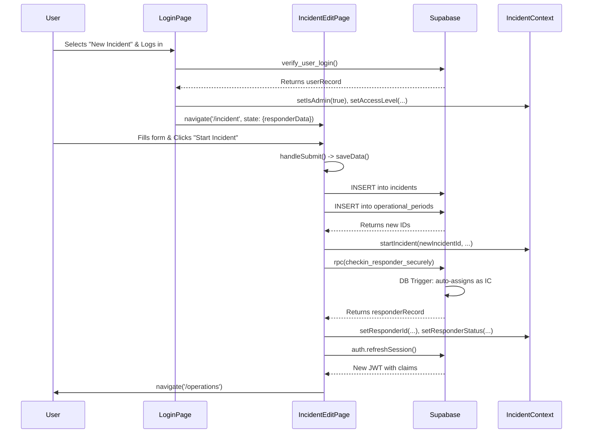

# SAROps Navigation and State Flow: Login to Incident Creation

This document provides a granular, step-by-step specification of the sequence of events, state changes, and control flow from the moment a user logs in to create a new incident until they are navigated to the Operations Dashboard.

## 1. Login Page (`/login`)

The flow begins on the `LoginPage`, which renders the `LoginForm` component.

1.  **User Interaction**:
    *   The user enters their email and password.
    *   From the "Check Into Incident" dropdown, the user selects the **"+ Start New Incident"** option.
    *   The user clicks the "Login" button.

2.  **Component: `LoginForm` (`/src/components/admin/Login.jsx`)**:
    *   The `onSubmit` event on the form triggers the `handleAdminLogin` function.

3.  **Function: `handleAdminLogin`**:
    *   Sets local `loading` state to `true`.
    *   Calls `supabase.rpc('verify_user_login', ...)` to authenticate the user's credentials against the `users` table. This RPC returns the user's profile data (`userRecord`).
    *   The function validates that the user has permission to create an incident (i.e., not a 'responder' access level trying to create one).
    *   Upon successful validation, it calls the `onLoginSuccess` prop, passing it the selected incident ID (`'NEW_INCIDENT'`), the `userRecord`, and any vehicle data.

4.  **Component: `LoginPage` (`/src/pages/loginpage.jsx`)**:
    *   The `onLoginSuccess` prop is wired to the `handleLoginSuccess` function within this component.

5.  **Function: `handleLoginSuccess`**:
    *   **State Change (Local Storage)**: The user's email is persisted to local storage: `localStorage.setItem('sarops_user_email', userRecord.email)`.
    *   **Control Flow**: The code enters the `if (selectedId === 'NEW_INCIDENT')` block.
    *   **State Change (Global Context)**: The `useIncident` context is updated:
        *   `setIsAdmin(true)`
        *   `setResponderName(userRecord.name || userRecord.username)`
        *   `setAccessLevel(userRecord.access_level)`
    *   **Navigation**: The application navigates to the incident creation page.
        *   `navigate('/incident', { state: { responderData: { ... } } })`
        *   Crucially, it passes the creator's profile information (`name`, `agency`, `identifier`, etc.) via `location.state`. This data is used for the auto check-in feature after the incident is created.

---

## 2. Incident Edit Page (`/incident`)

The user is now on the `IncidentEditPage`, ready to define the new incident.

1.  **Component Initialization**:
    *   The component mounts and its state is initialized with default values for a new incident (`defaultIncident`, `defaultOperationalPeriod`).
    *   A `useEffect` hook runs `initSession` to ensure a Supabase auth session exists, creating an anonymous one if needed. This is required for RLS policies to pass.
    *   The component retrieves the `responderData` object from `location.state` which was passed during navigation.

2.  **User Interaction**:
    *   The user fills out the "Incident Information" and "Operational Period" forms.
    *   The user clicks the "Start Incident Tracking" button.

3.  **Event Handling**:
    *   The form's `onSubmit` event triggers the `handleSubmit` function.

4.  **Function: `handleSubmit`**:
    *   Sets local `isSubmitting` state to `true`.
    *   Calls `await saveData(false, true)`. This function handles the core database operations.

5.  **Function: `saveData` (New Incident Path)**:
    *   Sets local `isSaving` state to `true`.
    *   Validates that an "Incident Number" has been provided.
    *   **Control Flow**: The `if (existingId)` block is skipped because this is a new incident.
    *   **Database Write (1)**: Creates the incident record by calling `supabase.from('incidents').insert({...})`.
    *   **Database Write (2)**: Creates the first operational period record by calling `supabase.from('operational_periods').insert({...})`.
    *   **Database Write (3)**: Logs the creation event by calling `supabase.from('action_logs').insert({...})`.
    *   **State Change (Global Context)**: Updates the global `useIncident` context with the newly created incident's details by calling `startIncident(...)`. This sets `isActive` to `true` and populates `incidentId`, `incidentData`, etc.
    *   Returns the `opPeriodId` of the newly created operational period.

6.  **Function: `handleSubmit` (Post-Save)**:
    *   **Control Flow**: Since `saveData` returned a valid `savedOpId`, the code proceeds.
    *   **Auto Check-in**: The `if (!wasActive && responderData)` block is executed.
        *   It retrieves the current user's session from `supabase.auth.getSession()`.
        *   It fetches the user's full profile from the `users` table to ensure their system `access_level` (e.g., 'admin') is preserved during the operational check-in.
        *   **Database Write (4)**: It calls the `checkin_responder_securely` RPC function. This is a critical step that:
            *   Creates a new record in the `responders` table for the incident creator.
            *   Sets their initial status to 'Deployed'.
            *   Associates their `auth.uid` with the responder record.
        *   **Database Write (5)**: It logs the creator's check-in action to `action_logs`.
        *   **Database Trigger**: The insertion into the `responders` table fires the `trigger_first_responder_ic_check` trigger in PostgreSQL. This trigger identifies that this is the first responder for the incident and automatically:
            *   Assigns them to the 'Staff' team.
            *   Sets their role as 'Incident Commander'.
            *   Sets them as the leader of the 'Staff' team.
    *   **State Change (Global Context)**: The `useIncident` context is updated with the creator's new operational identity:
        *   `setResponderId(finalResponder.responder_id)`
        *   `setResponderName(finalResponder.name)`
        *   `setResponderStatus(finalResponder.status)`
        *   `setAccessLevel(userAccessLevel)`
    *   **State Change (Auth)**: `supabase.auth.refreshSession()` is called. This is essential to apply the new JWT claims (like `incident_id` and the elevated `staff` role) that are set by database triggers, ensuring subsequent RLS policies work correctly.

7.  **Final Navigation**:
    *   **Control Flow**: The code checks if the navigation originated from the admin page (`fromAdmin`). In this flow, it did not.
    *   **Navigation**: The application navigates to the operations dashboard: `navigate('/operations')`.

---

## Summary of State Changes and Control Flow

