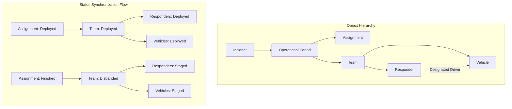

# SAROps Object Associations and Hierarchy

This document describes the relationships and structural hierarchy of the primary objects within the SAROps application. 

## 1. Top-Level Hierarchy

The application follows a strict nesting structure to maintain operational integrity across different phases of a mission.

### Incident
The root container for all search activity.
*   **Incident ID**: Typically derived from the agency tracking number.
*   **Contains**: Multiple **Operational Periods**.
*   **Global Resources**: All **Responders** and **Vehicles** are checked into an Incident first before being assigned to sub-structures.

### Operational Period (OP)
A time-boxed segment of the mission (e.g., Day 1, Night Shift).
*   **Parent**: Incident.
*   **Contains**: 
    *   **Assignments**: Tasks specific to this timeframe.
    *   **Teams**: Personnel groupings organized for this timeframe.

---

## 2. Resource Associations

Resources (Personnel and Equipment) follow a progression from a global pool to specific tactical units.

### Responders (Personnel)
*   **Incident Level**: Responders check into an **Incident** and start in `Staged` status.
*   **Team Attachment**: A Responder can be attached to one **Team** at a time.
    *   When attached to a `Staged` team, the Responder is `Attached`.
    *   When the Team is assigned to a task, the Responder is `Assigned`.
*   **Vehicle Designation**: A Responder can be designated as the **Driver** for one or more **Vehicles**.

### Vehicles (Equipment)
*   **Incident Level**: Vehicles (UTVs, Boats, Helicopters, etc.) are checked into an **Incident** and start in `Staged` status.
*   **Driver Association**: A Vehicle can have a designated **Driver** (Responder).
*   **Team Attachment**: A Vehicle can be attached to a **Team**.
    *   **Automated Attachment**: If a Vehicle with a designated Driver is attached to a Team, the system automatically attaches the **Driver** to that same Team.

---

## 3. Tactical Associations

How work is mapped to resources.

### Teams
A functional unit consisting of at least one Leader, optional Members, and optional Vehicles.
*   **Parent**: Operational Period.
*   **Composition**:
    *   1 **Team Leader** (Responder).
    *   0+ **Team Members** (Responders).
    *   0+ **Team Vehicles**.
*   **Assignment Link**: A Team is assigned to exactly one **Assignment** to move from `Staged` to `Assigned`.

### Assignments (Tasks)
A defined objective or search area.
*   **Parent**: Operational Period.
*   **Resource Link**: An Assignment is linked to exactly one **Team**.
*   **Status Synchronization**: 
    *   Moving an Assignment to `Deployed` automatically marks the linked **Team**, its **Responders**, and its **Vehicles** as `Deployed`.
    *   Completing an Assignment automatically disbands the **Team** and returns all **Responders** and **Vehicles** to `Staged` status.

---

## 4. Entity Relationship Summary

| Object A | Relationship | Object B | Note |
| :--- | :--- | :--- | :--- |
| **Incident** | Has Many | **Operational Periods** | Primary mission container. |
| **Operational Period** | Has Many | **Assignments** | Tasking specific to a shift. |
| **Operational Period** | Has Many | **Teams** | Logistics specific to a shift. |
| **Assignment** | Has One | **Team** | A task is performed by one team. |
| **Team** | Has Many | **Responders** | Personnel assigned to the unit. |
| **Team** | Has Many | **Vehicles** | Equipment assigned to the unit. |
| **Responder** | Drives | **Vehicle** | Designation for equipment operation. |
| **Responder** | Member Of | **Team** | Personnel tactical assignment. |
| **Vehicle** | Member Of | **Team** | Equipment tactical assignment. |

---

## 5. Visual Representation

### Hierarchy and Status Synchronization

