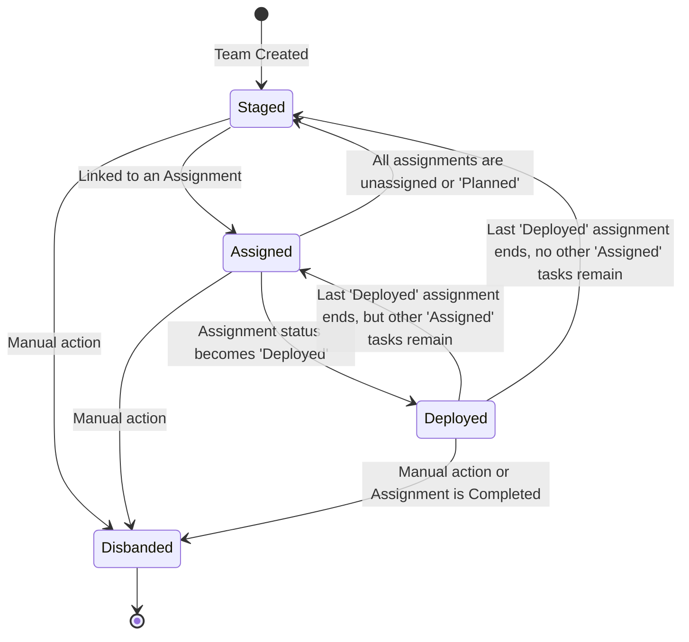
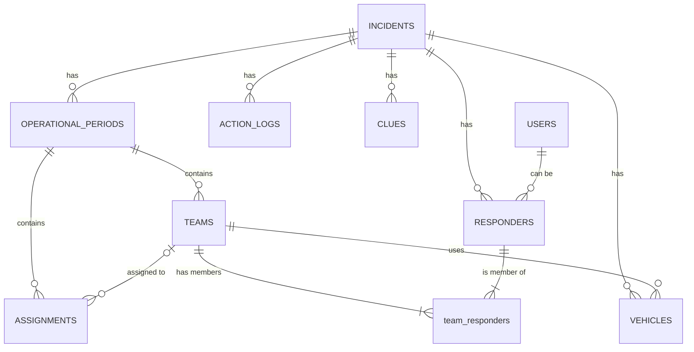

# SAROps Complete Application Specification

This document provides a complete technical specification for the SAROps application, combining details on UI, data models, authentication, and special workflows.

---

## 1. High-Level Architecture

- **Frontend**: A React-based Single Page Application (SPA) built with Vite.
- **Backend & Database**: Supabase (PostgreSQL) for data persistence, real-time updates, and authentication.
- **State Management**: Global state for the active incident, user session, and operational context is managed via a React Context (`useIncident`).
- **Styling**: A combination of global CSS files and component-specific styles, organized in the `@src/styles` directory.

---

## 2. UI Components

### 2.1. Main Application Banner

The main application banner appears at the top of every page and provides at-a-glance context about the user's session, incident status, and provides access to global navigation.

#### Layout

The banner is divided into three main sections:

1.  **Left Section (`banner-left`)**: Contains application branding and the database instance indicator (`LOCAL` or `REMOTE`).
2.  **Center Section (`banner-item`)**: Displays the current operational context (e.g., "Lost Hiker — OP #1"). This is only visible when an incident is active.
3.  **Right Section (`banner-right`)**: Shows user identity, status, notifications, and the main navigation menu.

#### Main Menu Dropdown

The dropdown menu provides conditional navigation links based on the user's access level and the application's state.

*   **General Links**: My Dashboard, Settings, ICS Chart, QR Codes, Check Out, Live Feed, Sign Out.
*   **Staff & Admin Links**: Operations, Planning, Incident, Action Log, SARTopo, Google Forms.
*   **Admin-Only Links**: Administration.

---

## 3. Authentication & Authorization

### 3.1. User Roles

The system defines three access levels:

1.  **`responder`**: Field personnel with access to their own dashboard and team information.
2.  **`staff`**: Command staff with access to operational and planning dashboards.
3.  **`admin`**: System administrators with full access, including user and system management.

### 3.2. Login & Session Flow

The primary login flow is detailed in `doc/NavSpec.md`.

1.  **Login (`/login`)**: A user authenticates via the `LoginForm` component. The `verify_user_login` RPC in Supabase validates credentials against the `users` table.
2.  **Incident Selection**:
    *   If the user selects an existing incident, they are checked into that incident via the `checkin_responder_securely` RPC.
    *   If a `staff` or `admin` user selects "+ Start New Incident", they are navigated to the `/incident` page to create a new incident.
3.  **Context Hydration**: Upon successful login and check-in, the global `useIncident` context is populated with the user's operational identity (`responderId`, `responderName`, `accessLevel`) and the active incident's data.
4.  **JWT Refresh**: `supabase.auth.refreshSession()` is called to apply new JWT claims (like `incident_id` and role) which are essential for Row Level Security (RLS) policies to function correctly.
5.  **Navigation**: The user is redirected to the appropriate dashboard based on their access level (`/operations` for staff/admin, `/responder` for responders).

---

## 4. Core Data Models & Logic

### 4.1. Team Management

A Team is a functional unit assigned to a specific **Operational Period**.

#### Data Model (`teams` table)

| Field | Type | Description |
| :--- | :--- | :--- |
| `team_id` | UUID | Primary Key. |
| `op_period_id` | UUID | Foreign Key to `operational_periods`. |
| `team_name_number` | TEXT | The user-defined or auto-generated name (e.g., "101"). |
| `type` | `team_type` ENUM | The functional type (e.g., Ground, Hasty, Staff). |
| `status` | `team_status` ENUM | The current operational status of the team. |
| `leader_responder_id`| UUID | Foreign Key to the designated leader in the `responders` table. |

#### Creation and Editing

- **UI**: Managed via the reusable `TeamFormModal.jsx` component.
- **Logic**:
    - A **Team Leader** is mandatory.
    - If the team name is blank, it is auto-generated as `{Operational Period #}{Incrementing Number}` with the number zero-padded to two digits (e.g., "101", "102" for the 1st and 2nd teams created in Operational Period 1). The incrementing number is a single sequence shared across all team types within the operational period, not scoped per type.
    - The `useTeamActions.js` hook orchestrates database operations.
    - The `ensure_leader_is_member` database trigger automatically adds the leader to the `team_responders` junction table.

#### Status Workflow

The status of a team is an **aggregate** of the statuses of all assignments it is linked to, managed by database triggers.

### 4.2. Assignment Management

An Assignment is a task defined within a specific **Operational Period**.

#### Data Model (`assignments` table)

| Field | Type | Description |
| :--- | :--- | :--- |
| `assignment_id` | UUID | Primary Key. |
| `op_period_id` | UUID | Foreign Key to `operational_periods`. |
| `team_id` | UUID | **Nullable** Foreign Key to `teams`. |
| `status` | `assignment_status` | The current operational status. |
| `title` | TEXT | The name of the assignment. |
| `completed_team_snapshot` | JSONB | Stores an immutable record of the team at completion. |

#### Team–Assignment Cardinality

- A team may be linked to zero, one, or many assignments.
- An assignment may be unassigned or linked to one team.
- The nullable `assignments.team_id` foreign key implements this relationship.

#### "Snapshot" Workflow for Completed Assignments

To preserve historical data integrity while allowing teams to be reused, the system employs a "snapshot" method when an assignment is completed.

1.  **Trigger**: The `sync_team_status_on_assignment_update` database trigger fires when an assignment's `status` changes to `Completed` or `Incomplete`.
2.  **Snapshot Creation**: A JSON object of the team's complete state (name, leader, members, vehicles) is generated.
3.  **Persistence**: This JSON object is written into the `completed_team_snapshot` column of the assignment.
4.  **Decoupling**: The `team_id` on the assignment record is set to `NULL`, breaking the live link.
5.  **Team Release**: The original team's `status` in the `teams` table is set back to `Staged`, making it available for a new task.

#### UI Implementation

UI components must be "snapshot-aware." When displaying team information for an assignment:

- If the assignment is **active** (`Planned`, `Assigned`, `Deployed`), the component uses the live `team_id` to fetch team data.
- If the assignment is **terminal** (`Completed`, `Incomplete`), the component must ignore the `team_id` and instead parse the `completed_team_snapshot` JSONB column to get the historical team data.

---

## 5. Special Workflows & Business Logic

This section details automated processes and role-based restrictions that ensure data integrity and operational correctness.

### 5.1. First Responder as Incident Commander (IC)

- **Description**: When the very first responder checks into a new incident, the system automatically assigns them as the Incident Commander (IC) and grants them `Staff` level access for that incident.
- **Mechanism**: A database trigger (`trigger_first_responder_ic_check`) identifies the "Staff" team for the new OP, adds the responder with the "Incident Commander" role, and updates their `access_level` in the `responders` table to `staff`.

### 5.2. Responder Double-Attachment Prevention

- **Description**: A responder cannot be actively assigned to more than one team at a time.
- **Mechanism**: The `validate_responder_active_membership` database trigger prevents an `INSERT` into the `team_responders` table if the responder is already a member of another active (non-disbanded) team.

### 5.3. Responder Check-out Restrictions

- **Description**: Responders cannot check out from an incident if they are actively deployed or attached to a team. A Team Leader cannot leave their team while it is deployed.
- **Mechanism**: UI logic in `AdminPage.jsx` and `ResponderDashboardPage.jsx` checks the responder's status before allowing the check-out or "Leave Team" action.

### 5.4. Automated Incident End Cleanup

- **Description**: When an incident is formally ended (by setting its `end_datetime`), a cascading cleanup process is automatically triggered in the database.
- **Mechanism**: The `trigger_incident_cleanup_on_end` database trigger calls the `cleanup_resources_on_incident_end` function, which:
    - Marks `Deployed` assignments as `Incomplete`.
    - Disbands all active teams.
    - Checks out all remaining responders.
    - Closes the operational period.

---

## 6. Offline Capabilities

- **Description**: The application provides offline support for creating and managing Clues.
- **Mechanism**:
    - **`offlineClueDB.ts`**: A service that uses `IndexedDB` to store `Clue` objects locally when the application is offline. It maintains a `synced` status for each record.
    - **`useOfflineClues.ts`**: A React hook that provides an interface for components to interact with the offline database. It monitors the browser's online/offline status.
    - **`offlineClueSync.ts`**: A service responsible for syncing the locally stored clues with the Supabase backend once the application comes back online. It includes progress tracking and error handling.

---

## 7. SARTopo Integration

- **Description**: The application can synchronize assignment data with a SARTopo/Caltopo map. This includes both downloading assignments from SARTopo and uploading changes from SAROps back to SARTopo.
- **Mechanism**:
    - **Supabase Edge Function (`sartopo-proxy`)**: API requests to SARTopo are securely handled by this function. It is responsible for signing requests with the `SARTOPO_API_CREDENTIAL_SECRET`, which is stored securely as a server-side secret and is never exposed to the client.
    - **`sartopoService.js`**: Contains client-side logic that calls the `sartopo-proxy` Edge Function. It does not handle any secrets directly.
        - `downloadAndSyncSartopoData`: Fetches GeoJSON data by calling the secure proxy, reconciles it with existing SAROps assignments, and upserts the data into the `assignments` table.
    - **`gisUtils.js`**: Provides mapping functions (`mapSartopoToAssignment`, `mapAssignmentToSartopo`) to translate data structures between the two systems.
    - **UI (`SARTopoDataPage.jsx`)**: Provides the user interface for initiating sync operations, viewing the raw GeoJSON data, and managing sync settings.

---

## 8. Google Sheets Integration

- **Description**: The application allows users to map operational data to named ranges within a Google Sheet, facilitating the creation of custom ICS forms and reports.
- **Mechanism**:
    - **Proxy Server (`sheets-proxy.js`)**: A simple Express.js server that acts as a backend proxy for Google Sheets API requests. This is necessary to securely handle Google API credentials (`GOOGLE_CLIENT_EMAIL`, `GOOGLE_PRIVATE_KEY`) which cannot be exposed on the client-side.
    - **UI (`GoogleICSFormsPage.jsx`)**:
        - The user provides a Google Sheets URL.
        - The frontend sends a request to the `/api/sheets/named-ranges` endpoint on the proxy server.
        - The proxy authenticates with Google and fetches the list of named ranges for the specified spreadsheet.
        - The UI displays the list of named ranges and a corresponding list of available SAROps data fields (e.g., `incident_name`, `op_period_number`).
        - The user can drag-and-drop to associate a SAROps field with a named range.
        - When "Transfer Data" is clicked, the frontend sends another request to the proxy with the mapped values, which then updates the Google Sheet.

---

## 9. PDF Form Auto-Filling

- **Description**: The application can automatically fill standard ICS PDF forms with data from the active incident context.
- **Mechanism**:
    - **UI (`PDFsPage.jsx`)**:
        - The component uses Vite's `import.meta.glob` to dynamically find all `.pdf` files in the `/src/assets` directory.
        - When a user selects a PDF, the `pdf-lib` library is used to parse the document in the browser.
        - The `getAutoFillValue` function contains a mapping of common form field names (using regular expressions to handle variations like "Incident Name" vs. "incident_name") to data from the `useIncident` context.
        - The component iterates through the detected fields in the PDF, and if a field name matches a regex in the mapping, it uses `pdf-lib` to set the field's text.
        - A new, auto-filled version of the PDF is generated as a `Blob` and displayed in an `<iframe>`.

---

## Appendix A: Database Schema Overview

*   **`incidents`**: The top-level table for each mission. Contains name, number, start/end times, and SARTopo ID.
*   **`operational_periods`**: Slices of an incident (e.g., OP 1, OP 2). Contains start/end times and narrative summaries.
*   **`responders`**: Records for every individual checked into an incident. Contains personal details, status, and access level for the session.
*   **`teams`**: Functional groups of responders for an operational period.
*   **`assignments`**: Specific tasks or areas assigned to teams.
*   **`team_responders`**: A junction table linking responders to teams.
*   **`vehicles`**: Records for vehicles checked into an incident. Can be attached to teams.
*   **`action_logs`**: An audit trail of significant events that occur during an incident.
*   **`clues`**: Records of findings in the field, with offline support.
*   **`users`**: System-level user accounts for authentication and authorization, distinct from the per-incident `responders` records.

### Key Relationships

---

## Appendix B: Core Hooks and Services

*   **`useIncident` (Context)**: The central nervous system of the application. Provides global access to the active incident's state, the current user's operational identity, and functions to modify this state (`startIncident`, `endIncident`).
*   **`usePlanningDashboard` (Hook)**: A comprehensive hook that encapsulates the complex data fetching and state management logic for the planning and operations dashboards. It handles fetching teams, assignments, responders, and vehicles for a given operational period and provides functions for all CRUD operations.
*   **`useAdminData` (Hook)**: Similar to `usePlanningDashboard` but designed for the `/admin` page. It fetches data across *all* incidents rather than a single operational period.
*   **`useResponderTeamAndAssignment` (Hook)**: A specialized hook for the `/responder` dashboard that fetches only the specific team and assignment relevant to the currently logged-in responder.
*   **Service Files (`/src/services`)**: Each service file (e.g., `teamService.js`, `assignmentService.js`) contains a collection of functions that perform specific, atomic database operations (e.g., `disbandTeam`, `saveAssignment`). These services are consumed by the hooks and pages to interact with the backend.
