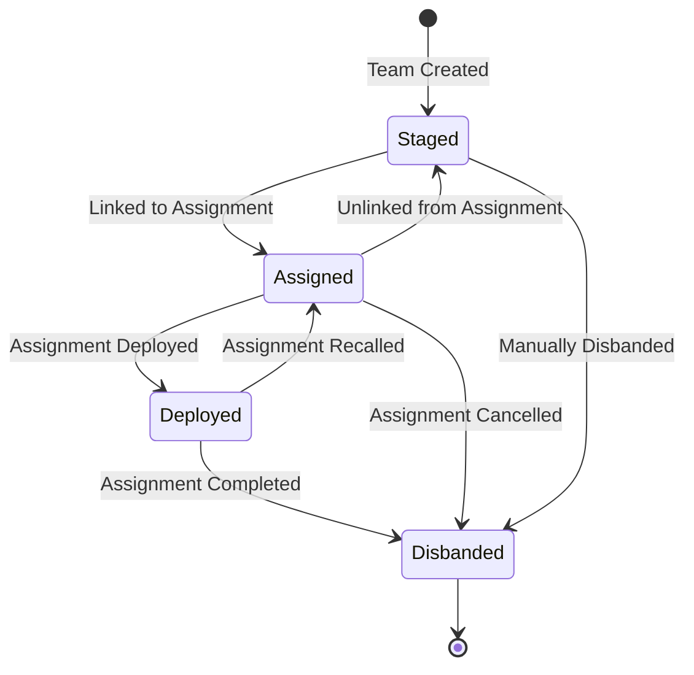

# SAROps Team Management Specification

This document provides a complete technical specification for the `Team` object within the SAROps application. It details the data model, creation and editing workflows, status progression, and the persistence mechanisms that ensure data integrity.

---

## 1. Team Data Model

A Team is a functional unit assigned to a specific **Operational Period**. Its data is primarily stored in the `teams` table.

| Field | Type | Description |
| :--- | :--- | :--- |
| `team_id` | UUID | Primary Key. A unique identifier for the team. |
| `op_period_id` | UUID | Foreign Key linking the team to a specific Operational Period. |
| `team_name_number` | TEXT | The user-defined or auto-generated name (e.g., "Ground 1", "Staff"). |
| `sartopo_color_hex`| TEXT | A hexadecimal color code for map display. Defaults to red (`#ff0000`). |
| `type` | `team_type` ENUM | The functional type of the team (e.g., Ground, Hasty, Staff, UAS). |
| `status` | `team_status` ENUM | The current operational status of the team. See workflow below. |
| `leader_responder_id`| UUID | Foreign Key linking to the designated leader in the `responders` table. |
| `equipment` | JSONB | A JSON array of text strings describing team equipment. |
| `last_par_check` | TIMESTAMP | Timestamp of the last Personnel Accountability Report (PAR) check. |
| `par_status` | TEXT | The current PAR status (e.g., 'OK', 'Overdue'). |

### Associated Data
*   **Team Members**: Stored in the `team_responders` junction table, which links `teams` to `responders`.
*   **Team Vehicles**: Managed via a `team_id` foreign key on the `vehicles` table.

---

## 2. Team Creation and Editing

Team management is handled through the reusable `TeamFormModal.jsx` component, which is used on both the Planning and Operations dashboards.

### Creation Workflow
1.  **Initiation**: A user clicks "New Team" on a dashboard, opening the `TeamFormModal`.
2.  **Composition**:
    *   A **Team Leader** is mandatory and must be assigned by dragging a staged responder into the "Leader" slot. The save button is disabled until a leader is chosen.
    *   **Team Members** are added by dragging responders from the "Staged Responders" pool into the members list.
    *   **Vehicles** are added by dragging from the "Staged Vehicles" pool.
3.  **Naming**: If the "Team Name" field is left blank, a name is auto-generated based on the team's `type` and the number of existing teams of that type (e.g., "Ground 1", "Ground 2").
4.  **Persistence**:
    *   The `onSave` event triggers the `createTeam` function in the `useTeamActions.js` hook.
    *   This function inserts a new record into the `teams` table.
    *   The `ensure_leader_is_member` database trigger automatically adds the `leader_responder_id` to the `team_responders` junction table.
    *   The hook then iterates through the `responder_ids` and `vehicle_ids` from the form to create the necessary links in `team_responders` and update the `team_id` on the `vehicles` table.

### Editing Workflow
The process is similar to creation, using the same modal but populated with the team's existing data.

*   **Adding/Removing Responders**:
    *   Drag a responder from the "Staged Responders" pool to the team list to add them.
    *   Drag a responder from the team list back to the pool to remove them.
*   **Persistence**:
    *   The `onSave` event triggers the `updateTeam` function in `useTeamActions.js`.
    *   This hook fetches the team's original state to calculate the difference in member and vehicle lists (`toAdd`, `toRemove`).
    *   It then calls the appropriate service functions (`attachResponderToTeam`, `detachResponderFromTeam`) or performs direct database updates to reconcile the lists.

---

## 3. Team Status Workflow

The status of a team dictates its operational state and is tightly synchronized with the status of its assigned responders, vehicles, and assignment.

#### `Staged`
*   **Entry**: The default status on creation. A team also returns to `Staged` if it is unassigned from a `Planned` assignment.
*   **Action**: The team is assembled and available for tasking. Its members have an `Attached` status.
*   **Exit**: Moves to `Assigned` when linked to an `Assignment`.

#### `Assigned`
*   **Entry**: Occurs when the team is linked to an `Assignment`. The `sync_team_status_on_assignment_update` trigger handles this.
*   **Action**: The team is committed to a task but not yet in the field. Its members have an `Assigned` status.
*   **Exit**: Moves to `Deployed` when the linked `Assignment`'s status is changed to `Deployed`.

#### `Deployed`
*   **Entry**: Occurs when the linked `Assignment`'s status is set to `Deployed`.
*   **Action**: The team is active in the field. The PAR timer (`last_par_check`) is activated. Its members have a `Deployed` status.
*   **Exit**: Moves to `Disbanded` when the assignment is marked `Completed` or `Incomplete`.

#### `Disbanded`
*   **Entry**: Occurs when the linked `Assignment` is completed, or when a user manually triggers the "Disband" action.
*   **Action**: This is a "soft delete". The team record is preserved for historical logs, but it is considered inactive.
*   **Effect**: All associated responders and vehicles are automatically returned to `Staged` status by the `sync_team_members_on_status_change` database trigger.

---

## 4. Responder and Vehicle Management

The status of responders and vehicles is automatically synchronized with their assigned team's status via database triggers.

*   **Attachment**:
    *   When a `Staged` responder is added to a `Staged` team, their status becomes `Attached`.
    *   This is managed by the `sync_responder_access_level` trigger, which fires when a new record is inserted into the `team_responders` table.
*   **Re-Staging (Detachment)**:
    *   When a team's status changes to `Disbanded`, the `sync_team_members_on_status_change` trigger finds all members in `team_responders` and all vehicles linked via `team_id`.
    *   It then updates their respective statuses in the `responders` and `vehicles` tables back to `Staged`, returning them to the available resource pool.
*   **Uniqueness and Validation**:
    *   The `validate_responder_active_membership` trigger prevents a responder from being added to a new team if they are already part of another active (non-disbanded) team, ensuring a responder can only be in one place at a time.
    *   The `validate_team_leader_membership` trigger performs a similar check specifically for team leaders.