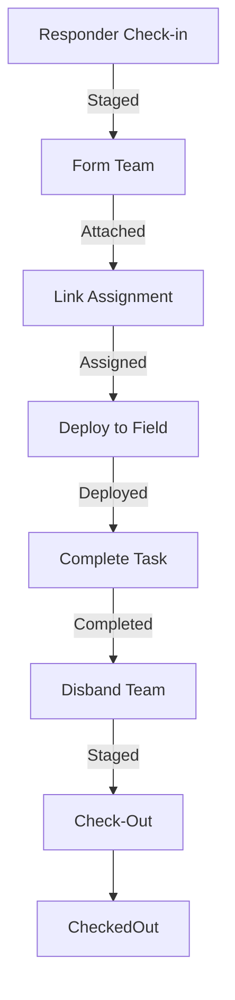

# SAROps Status Progression Guide

This document details the lifecycle and status transitions for the three primary operational entities in SAROps: **Responders**, **Teams**, and **Assignments**. 

## 1. Status Definitions

| Entity | Statuses |
| :--- | :--- |
| **Responder** | `Staged`, `Attached`, `Assigned`, `Deployed`, `CheckedOut` |
| **Team** | `Staged`, `Assigned`, `Deployed`, `Disbanded` |
| **Assignment** | `Planned`, `Assigned`, `Deployed`, `Completed`, `Incomplete` |

---

## 2. Typical Progression Lifecycles

### Responder Lifecycle
1.  **Staged**: The responder has checked into the incident but is not yet part of a team.
2.  **Attached**: The responder has been added to a team (the team is currently `Staged`).
3.  **Assigned**: The responder's team has been linked to an assignment (the team is `Assigned`).
4.  **Deployed**: The responder's team has moved to the field (the team is `Deployed`).
5.  **CheckedOut**: The responder has signed out of the incident. This triggers removal from any teams.

### Team Lifecycle
1.  **Staged**: The team is formed with a leader and members but has no assignment.
2.  **Assigned**: The team is linked to an active assignment.
3.  **Deployed**: The team is active in the field. PAR (Personnel Accountability Report) timers are active.
4.  **Disbanded**: The mission is complete or cancelled. Members are released back to `Staged`.

### Assignment Lifecycle
1.  **Planned**: The task is defined in the system but no team is assigned.
2.  **Assigned**: A team has been linked to the task.
3.  **Unassigned**: If a team is unlinked from an assignment, the team status returns to `Staged`. This transition automatically triggers the Team -> Responder Sync, reverting member statuses to `Attached`.
    *   **Requirement**: When a team is unassigned, the team status should return to `Staged` and the team members’ statuses should return to `Attached`.
4.  **Deployed**: The assigned team is active in the field.
5.  **Completed / Incomplete**: The task is finished. This automatically disbands the attached team.

---

## 3. Synchronization Logic (Database Triggers)

The system uses PostgreSQL triggers to maintain "operational parity," ensuring that status changes in one table correctly update related entities.

### Assignment -> Team Sync
*   **Planned / Unassigned**: If a team is unlinked, the team returns to `Staged`. This transition cascade automatically returns team members to `Attached` status.
*   **Assigned**: Moving an assignment to `Assigned` moves the linked team to `Assigned`.
*   **Deployed**: Moving an assignment to `Deployed` moves the linked team to `Deployed` and starts the PAR timer.
*   **Completed / Incomplete**: These terminal statuses trigger the linked team to move to `Disbanded`.

### Team -> Responder Sync
*   **Staged**: Responders attached to a `Staged` team are marked as `Attached`.
*   **Assigned**: Responders move to `Assigned`.
*   **Deployed**: Responders move to `Deployed`.
*   **Disbanded**: All members are released and their status reverts to `Staged`.

### Special Cases
*   **Command Staff**: When a new Operational Period is created, a `Staff` team and a `Command Staff` assignment are automatically created in `Deployed` status. The first responder to check in is auto-assigned as the Incident Commander.
*   **Incident End**: Setting an `end_datetime` on an incident performs a bulk cleanup:
    *   All `Deployed` assignments become `Incomplete`.
    *   All `Assigned` assignments become `Planned`.
    *   All active teams are `Disbanded`.
    *   All responders are moved to `CheckedOut`.

---

## 4. Operational Flow Summary

*Note: Staff members skip the "Staged" and "Attached" phases and typically remain "Deployed" for the duration of their shift.*